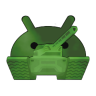

# ProTankiAndroid

Launcher to start [ProTanki](http://pro-tanki.com) on Android devices using Adobe AIR.

> [!NOTE]  
> There are no on-screen controls yet, so you’ll need a physical keyboard to play battles.
> Alternatively, you can try connecting a gamepad — see the control mapping below.

## 🎮 Gamepad Controls Mapping

| Action              | Gamepad Button           |
|---------------------|--------------------------|
| Move tank forward   | D-Pad Up                 |
| Move tank backward  | D-Pad Down               |
| Turn tank left      | D-Pad Left               |
| Turn tank right     | D-Pad Right              |
| Shoot               | Right Trigger (RT / R2)  |
| Rotate turret left  | Right Stick Left         |
| Rotate turret right | Right Stick Right        |
| Center turret       | Right Stick Click (R3)   |
| Move camera up      | Right Stick Up           |
| Move camera down    | Right Stick Down         |
| Use First Aid       | Left Bumper (LB / L1)    |
| Use Double Armor    | Y / Triangle             |
| Use Double Damage   | A / Cross                |
| Use Nitro           | B / Circle               |
| Drop Mine           | X / Square               |
| Drop Flag           | Right Bumper (RB / R1)   |
| Self-destruct       | Left Trigger (LT / L2)   |
| View the statistics | Select                   |
